# ChargeBro Backend

Spring Boot backend for a powerbank sharing service, handling station management, user authentication, rentals, and payments.

<p align="center">
  
</p>

> **Note:** This project was developed in 2020–2021 as part of a startup that is no longer active. It is not actively maintained. The code is shared for educational purposes and as a portfolio piece.

## Features

- **Station Communication** - Custom TCP socket protocol for charging station hardware
- **REST API** - Mobile app backend with JWT authentication
- **WebSocket Updates** - Real-time station status updates for mobile clients
- **SMS Authentication** - Phone number verification via SMS gateway
- **Payment Processing** - Integration with Fondy payment provider
- **Telegram Notifications** - Admin alerts via Telegram bot
- **Swagger Documentation** - Auto-generated API docs

## Tech Stack

- **Framework:** Spring Boot 2.x
- **Database:** MongoDB
- **Security:** Spring Security + JWT
- **Real-time:** WebSockets, Netty (for station sockets)
- **Build:** Gradle
- **Deployment:** Dokku

## Architecture

```mermaid
graph TB
    subgraph Mobile App
        APP[📱 ChargeBro App]
    end

    subgraph Backend Server
        REST[REST API<br/>JWT Auth]
        WS[WebSocket Server<br/>Real-time Updates]
        SOCKET[TCP Socket Server<br/>Port 10382]
    end

    subgraph External Services
        SMS[SMS Gateway]
        PAY[Fondy Payments]
        TG[Telegram Bot]
    end

    subgraph Hardware
        STATION[🔌 Charging Stations]
    end

    subgraph Database
        MONGO[(MongoDB)]
    end

    APP <-->|HTTPS| REST
    APP <-->|WSS| WS
    STATION <-->|TCP Binary Protocol| SOCKET

    REST --> MONGO
    REST --> SMS
    REST --> PAY
    REST --> TG

    SOCKET --> MONGO
    WS --> MONGO
```



### Code Structure

```
src/main/java/com/mykovolod/takeandcharge/
├── cabinet/                    # Station communication (TCP sockets)
├── controller/                 # REST API endpoints
├── service/                    # Business logic
├── entity/                     # MongoDB documents
├── repository/                 # Data access layer
├── security/                   # JWT authentication
└── config/                     # Spring configuration
```

## Setup

### Prerequisites

- Java 11+
- MongoDB
- Gradle

### Local Development

1. Install [MongoDB](https://docs.mongodb.com/manual/administration/install-community/)

2. Create `src/main/resources/application-default.properties`:

```properties
SMS_GATEWAY=https://your-sms-gateway.com
SMS_GATEWAY_TOKEN=your-sms-token
SMS_TOKEN=your-sms-secret
PAY_USER=your-fondy-merchant-id
PAY_PASS=your-fondy-password
PAY_LINK=https://pay.fondy.eu/api
TELEGRAM_BOT_KEY=your-telegram-bot-token
TELEGRAM_ADMIN_CHAT_ID=your-chat-id
AUTH_TOKEN=your-jwt-secret
CALLBACK_URI=http://localhost:10381
MONGO_URL=mongodb://localhost:27017/chargebro
```

3. Run the application:

```bash
./gradlew bootRun
```

4. Access Swagger UI: http://localhost:10381/swgr.html

### Station Connection (for hardware testing)

The backend listens on port 10382 for charging station connections. For local testing with real hardware:

1. Set up port forwarding on your router (ports 10381, 10382)
2. Configure static DHCP for your machine
3. Update station firmware with your server IP

## API Endpoints

| Method | Endpoint | Description |
|--------|----------|-------------|
| POST | `/auth/init` | Start phone verification |
| POST | `/auth/login` | Complete login with SMS code |
| GET | `/station/all` | List all stations |
| GET | `/station/{id}` | Get station details |
| POST | `/rent/start` | Start a rental |
| POST | `/rent/stop` | End a rental |
| GET | `/user/me` | Current user info |

## Deployment (Dokku)

<details>
<summary>Click to expand deployment instructions</summary>

### Setup new server

1. Create [new server and access it via SSH](https://www.banjocode.com/post/hosting/setup-server-hetzner/)
2. Install [dokku](https://dokku.com/docs/getting-started/installation/#1-install-dokku)
3. Run the following commands:

```bash
dokku git:allow-host github.com
dokku mongo:create chargebro-db
dokku apps:create chargebro
dokku mongo:link chargebro-db chargebro
dokku docker-options:add chargebro deploy "-p 10382:10382/tcp"
dokku resource:limit --memory 500m chargebro
dokku domains:add chargebro your-domain.com
dokku checks:disable chargebro
dokku config:set chargebro \
   DOKKU_LETSENCRYPT_EMAIL='your-email@example.com' \
   AUTH_TOKEN='your-jwt-secret' \
   CALLBACK_URI='https://your-domain.com' \
   JAVA_OPTS='-Xmx200m' \
   PAY_LINK='https://pay.fondy.eu/api' \
   PAY_PASS='your-fondy-password' \
   PAY_USER='your-fondy-merchant-id' \
   SMS_GATEWAY='your-sms-gateway' \
   SMS_GATEWAY_TOKEN='your-sms-token' \
   SMS_TOKEN='your-sms-secret' \
   TELEGRAM_BOT_KEY='your-telegram-bot-key' \
   TELEGRAM_ADMIN_CHAT_ID='your-chat-id'
```

4. Set up GitHub authentication for dokku
5. Enable SSL: `dokku letsencrypt:enable chargebro`

### Deploy

```bash
dokku ps:stop chargebro  # Free memory for build
dokku git:sync --build chargebro https://github.com/your-username/chargebro-backend.git
```

</details>

## Maintenance

```bash
# Check for dependency vulnerabilities
./gradlew dependencyCheckAnalyze

# Update dependencies to latest versions
./gradlew useLatestVersions
```

## Technical Challenges & Solutions

<details>
<summary>Click to expand engineering deep-dive</summary>

This project involved solving several non-trivial engineering problems:

### 🔌 Custom Binary Protocol for Hardware Communication

**Challenge:** The charging stations used a proprietary binary protocol over TCP sockets. No documentation existed—only a Chinese hardware manual and packet captures.

**Solution:** Built a custom serialization framework using Java reflection and annotations:
- Created `@ProtocolField` annotation to map Java objects to binary wire format
- Implemented `ProtocolSerializationUtils` for bidirectional serialization
- Handled unsigned integers (Java's signed types don't natively support this)
- Built connection pooling with heartbeat monitoring and automatic reconnection

```java
// Example: Declarative binary protocol mapping
public class HeartbeatMessage {
    @ProtocolField(position = 0, dataType = DataType.BYTE)
    private short command;
    
    @ProtocolField(position = 1, dataType = DataType.BYTE8STRING)
    private String stationId;
}
```

### 💳 Two-Phase Payment Flow

**Challenge:** Implementing a deposit-hold-charge pattern where money is held before rental and charged based on actual usage time.

**Solution:** Designed a state machine for rent lifecycle:
1. `CHECK` → Verify powerbank availability
2. `HOLD_DEPOSIT` → Pre-authorize deposit amount
3. `POWERBANK_UNLOCKED` → Hardware releases powerbank
4. `POWERBANK_TAKEN` → User has the device
5. `CHARGE_MONEY` → Calculate and charge actual rental fee
6. `FINISHED` → Release remaining deposit

Handled edge cases: insufficient funds on return, payment gateway timeouts, partial refunds.

### 🔄 Real-Time State Synchronization

**Challenge:** Mobile app needed instant updates when powerbank is taken/returned, but stations communicate via TCP (not HTTP).

**Solution:** Bridged TCP socket events to WebSocket clients:
- Station sends binary message → `StationSocketHandler` processes
- State change triggers → `WebSocketServer.sendRentStartMessage()`
- Mobile app receives instant notification

### 🛡️ Stateless JWT with Phone-Based Auth

**Challenge:** No passwords—users authenticate via SMS verification codes (common in Ukraine/Eastern Europe).

**Solution:** Two-token system:
- Short-lived SMS token (2 min) for verification flow
- Long-lived auth token (200 hours) for API access
- Separate secrets for each token type to limit blast radius

### 📊 Operational Monitoring

**Challenge:** Needed visibility into station health and rental issues without building a full admin dashboard.

**Solution:** Telegram bot integration for real-time alerts:
- Station went offline/online notifications
- Rental start/end confirmations
- Payment failures and error conditions
- Scheduled job to detect "stuck" rentals (powerbank not returned >24h)

---

## Lessons Learned

- **Hardware integration is unpredictable** — Built extensive logging and error recovery because stations would randomly disconnect
- **Payment edge cases are endless** — "Not sufficient funds" on return required reversing deposit first, then charging
- **MongoDB flexibility helped** — Schema evolved rapidly during development without migrations
- **Telegram > Email for alerts** — Instant notifications on phone were crucial for a two-person startup

</details>

## Mobile App

This backend is designed to work with the [ChargeBro Mobile App](https://github.com/vladmykol/chargebro-mobile).

## License

This project is provided as-is for educational purposes. Feel free to use it as a reference for building similar applications.

## Author

Developed by [Vlad Mykol](https://vladmykol.com/) ([GitHub](https://github.com/vladmykol)) in 2020–2021.
